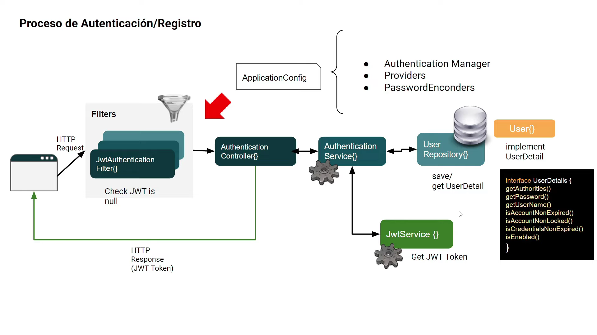
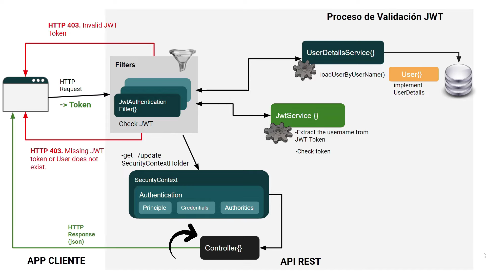

# RateBook


## Índice

1. [Shields](#shields)
   - [Backend](#backend-shields)
   - [Frontend](#frontend-shields)
2. [Descripción](#descripción)
3. [Diagrama de Base de Datos](#diagrama-de-base-de-datos)
4. [Diagrama JWT](#diagrama-jwt)
5. [Características](#características)
   - [Calificaciones de Artículos](#calificaciones-de-artículos)
   - [Reseñas de Usuarios](#reseñas-de-usuarios)
   - [Comentarios](#comentarios)
6. [Restricciones](#restricciones)
7. [Requisitos del Proyecto](#requisitos-del-proyecto)
   - [Backend](#backend)
   - [Frontend](#frontend)
   - [Base de Datos](#base-de-datos)
   - [Despliegue](#despliegue)
8. [Ejecución del Proyecto](#ejecución-del-proyecto)
   - [Pasos para Ejecutar el Proyecto](#pasos-para-ejecutar-el-proyecto)

## Descripción

RateBook es una plataforma donde los usuarios pueden calificar y reseñar películas, series y libros. La aplicación permite descubrir nuevos contenidos a través de las opiniones y calificaciones de otros usuarios. Las calificaciones se realizan con estrellas, mientras que las reseñas y comentarios pueden recibir interacciones con "likes" o "dislikes". Además, los usuarios pueden gestionar sus reseñas y acceder a recomendaciones personalizadas.

## Diagrama de Base de Datos

El siguiente diagrama proporciona una visión clara de la estructura de la base de datos:

[](https://dbdiagram.io/d/RateBook-66a6c2088b4bb5230e921f66)

## Diagramas JWT

El diagrama de autenticación con JWT (registro y login) se muestra a continuación. Este diagrama se inspiró en el siguiente [video de YouTube](https://youtu.be/nwqQYCM4YT8?si=-v8o0gCAXOmYo7rk).

### Registro

### Login


## Características

### Calificaciones de Artículos

Los usuarios pueden calificar películas, series y libros con una escala de estrellas. Cada artículo mostrará los siguientes elementos:

- **Título**
- **Imagen**
- **Descripción**
- **Etiqueta o tema**
- **Calificación promedio**

### Reseñas de Usuarios

Los usuarios pueden escribir reseñas sobre los artículos, las cuales:

- Solo pueden ser escritas una vez por artículo.
- No se pueden comentar, pero pueden recibir "likes" ❤️ o "dislikes" 👎.
- Permiten visualizar el número de vistas.

### Comentarios

Los usuarios pueden comentar los artículos y responder a otros comentarios. Tanto los comentarios como las respuestas pueden recibir "likes" ❤️ o "dislikes" 👎.

## Restricciones

- Cada usuario puede escribir solo una reseña por artículo.
- Las reseñas no se pueden comentar, solo pueden recibir interacciones de "likes" ❤️ o "dislikes" 👎.

## Requisitos del Proyecto

### Backend

1. **Tecnologías:** Spring Boot, Maven, MySQL.
2. **Autenticación y Autorización:** Implementada con JWT (JSON Web Tokens).
3. **Endpoints Principales:**
   - Gestión de usuarios (registro, inicio de sesión, actualización de perfil).
   - Gestión de productos (administradores pueden agregar, editar y eliminar artículos).
   - Evaluación de productos (usuarios pueden calificar, reseñar y comentar artículos).

### Frontend

1. **Tecnologías:** Next.js, Tailwind CSS.
2. **Funcionalidades:**
   - Páginas para registro e inicio de sesión.
   - Vistas para la visualización de artículos con calificaciones y reseñas.
   - Sección de administración para agregar, editar y eliminar artículos.

### Base de Datos

1. **Tecnología:** MySQL.
2. **Esquema:** Tablas para usuarios, artículos (películas, series, libros), calificaciones, reseñas, y comentarios.
3. **Migraciones:** Gestionadas mediante un sistema de migración como Flyway o Liquibase.

### Despliegue

1. **Backend:** Desplegado en servicios como Heroku, con la base de datos MySQL gestionada en ClearDB o PlanetScale.
2. **Frontend:** Desplegado en Vercel.
3. **Docker:** Contenedores Docker para cada componente (backend y frontend), con archivos `docker-compose` para desarrollo y producción.

## Distribución de Endpoints

| Sección           | Método | Endpoint             | Descripción                                 | Rol Requerido |
| ----------------- | ------ | -------------------- | ------------------------------------------- | ------------- |
| **Autenticación** | `POST` | `/api/auth/register` | Registro de un nuevo usuario                | Anónimo       |
|                   | `POST` | `/api/auth/login`    | Inicio de sesión                            | Anónimo       |
|                   | `POST` | `/api/auth/logout`   | Cerrar sesión                               | Registrado    |
|                   | `GET`  | `/api/auth/me`       | Obtener información del usuario autenticado | Registrado    |

---

| Sección      | Método   | Endpoint                      | Descripción                                   | Rol Requerido |
| ------------ | -------- | ----------------------------- | --------------------------------------------- | ------------- |
| **Usuarios** | `GET`    | `/api/users`                  | Obtener lista de usuarios                     | Admin         |
|              | `GET`    | `/api/users/{id}`             | Obtener detalles de un usuario específico     | Admin         |
|              | `PUT`    | `/api/users/profile`          | Actualizar perfil del usuario autenticado     | Registrado    |
|              | `DELETE` | `/api/users/profile`          | Eliminar cuenta del usuario autenticado       | Registrado    |
|              | `PATCH`  | `/api/users/profile/password` | Cambiar la contraseña del usuario autenticado | Registrado    |

---

| Sección       | Método   | Endpoint             | Descripción                                | Rol Requerido |
| ------------- | -------- | -------------------- | ------------------------------------------ | ------------- |
| **Productos** | `GET`    | `/api/products`      | Obtener lista de productos                 | Anónimo       |
|               | `GET`    | `/api/products/{id}` | Obtener detalles de un producto específico | Anónimo       |
|               | `POST`   | `/api/products`      | Crear un nuevo producto                    | Admin         |
|               | `PUT`    | `/api/products/{id}` | Actualizar un producto                     | Admin         |
|               | `DELETE` | `/api/products/{id}` | Eliminar un producto                       | Admin         |

---

| Sección     | Método   | Endpoint                           | Descripción                              | Rol Requerido |
| ----------- | -------- | ---------------------------------- | ---------------------------------------- | ------------- |
| **Reseñas** | `GET`    | `/api/reviews/product/{productId}` | Obtener todas las reseñas de un producto | Anónimo       |
|             | `POST`   | `/api/reviews/product/{productId}` | Crear una reseña para un producto        | Registrado    |
|             | `PUT`    | `/api/reviews/{id}`                | Editar una reseña propia                 | Registrado    |
|             | `DELETE` | `/api/reviews/{id}`                | Eliminar una reseña propia               | Registrado    |

---

| Sección         | Método   | Endpoint                            | Descripción                                   | Rol Requerido |
| --------------- | -------- | ----------------------------------- | --------------------------------------------- | ------------- |
| **Comentarios** | `GET`    | `/api/comments/product/{productId}` | Obtener comentarios de un producto            | Anónimo       |
|                 | `POST`   | `/api/comments/product/{productId}` | Crear un comentario para un producto          | Registrado    |
|                 | `PUT`    | `/api/comments/{id}`                | Editar un comentario propio                   | Registrado    |
|                 | `DELETE` | `/api/comments/{id}`                | Eliminar un comentario propio                 | Registrado    |
|                 | `POST`   | `/api/comments/{commentId}/reply`   | Responder a un comentario                     | Registrado    |
|                 | `GET`    | `/api/comments/{commentId}/replies` | Obtener respuestas a un comentario específico | Anónimo       |

---

| Sección              | Método   | Endpoint                                 | Descripción                    | Rol Requerido |
| -------------------- | -------- | ---------------------------------------- | ------------------------------ | ------------- |
| **Likes y Dislikes** | `POST`   | `/api/likes/product/{productId}`         | Dar like a un producto         | Registrado    |
|                      | `DELETE` | `/api/likes/product/{productId}`         | Quitar like a un producto      | Registrado    |
|                      | `POST`   | `/api/likes/review/{reviewId}`           | Dar like a una reseña          | Registrado    |
|                      | `DELETE` | `/api/likes/review/{reviewId}`           | Quitar like a una reseña       | Registrado    |
|                      | `POST`   | `/api/likes/comment/{commentId}`         | Dar like a un comentario       | Registrado    |
|                      | `DELETE` | `/api/likes/comment/{commentId}`         | Quitar like a un comentario    | Registrado    |
|                      | `POST`   | `/api/likes/product/{productId}/dislike` | Dar dislike a un producto      | Registrado    |
|                      | `DELETE` | `/api/likes/product/{productId}/dislike` | Quitar dislike a un producto   | Registrado    |
|                      | `POST`   | `/api/likes/review/{reviewId}/dislike`   | Dar dislike a una reseña       | Registrado    |
|                      | `DELETE` | `/api/likes/review/{reviewId}/dislike`   | Quitar dislike a una reseña    | Registrado    |
|                      | `POST`   | `/api/likes/comment/{commentId}/dislike` | Dar dislike a un comentario    | Registrado    |
|                      | `DELETE` | `/api/likes/comment/{commentId}/dislike` | Quitar dislike a un comentario | Registrado    |

## Ejecución del Proyecto

1. **Clonar el repositorio:**

   ```bash
   git clone https://github.com/nicoarbelaez/RateBook.git
   cd RateBook
   ```

2. **Construir y ejecutar el entorno de desarrollo:**

   ```bash
   cd docker
   docker-compose -f docker-compose.dev.yml up --build
   ```

3. **Construir y ejecutar el entorno de producción:**

   ```bash
   cd docker
   docker-compose -f docker-compose.prod.yml up --build -d
   ```

4. **Acceder a la aplicación:**
   - El frontend estará disponible en [http://localhost:3000](http://localhost:3000)
   - La API estará disponible en [http://localhost:8080](http://localhost:8080)
